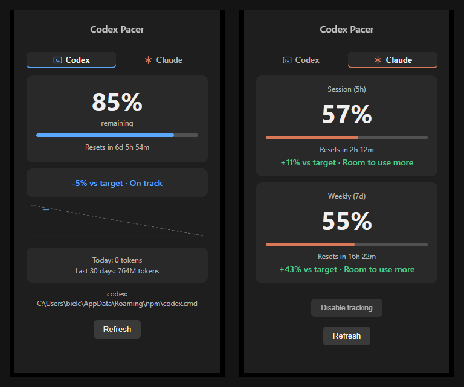

<div align="center">

# Codex Pacer

### A system tray app that tells you whether to slow down — not just how much usage is left.

[](https://github.com/Bielcx/Codex-Pacer/actions/workflows/ci.yml)
[](LICENSE)
[](https://buymeacoffee.com/bielcx)



</div>

Most usage trackers just show raw numbers. Codex Pacer compares your actual usage against a straight-line target trajectory to the next reset and gives you a plain verdict: **Slow down**, **On track**, or **Room to use more**. Tracks [Codex CLI](https://github.com/openai/codex) natively; [Claude Code](https://claude.com/claude-code) rate limits on a second tab, opt-in.

> Independent, unofficial project — not affiliated with or endorsed by OpenAI or Anthropic. Inspired by [codex-limits](https://github.com/thrr87/codex-limits) (macOS), rewritten to run outside the Apple ecosystem.

## What it does

- Reads real usage from Codex CLI's `app-server` and (opt-in) Claude Code's `statusLine` hook.
- Compares usage to a target trajectory and shows a burn-down chart plus the verdict.
- Tracks token usage (today / last 30 days) and keeps 90 days of local history.
- Auto-refreshes on window focus, every 10 minutes, and on demand.

## Privacy

- No credentials read, stored, or transmitted. Codex tracking talks to your already-logged-in `codex` CLI; Claude Code tracking only reads a local JSON file its own hook script writes.
- No browser cookies, no OAuth, no Keychain/credential-store access, anywhere.
- Everything lives locally as JSON files under the OS app-data directory. No telemetry, no analytics, no network calls beyond what the CLIs themselves make.

Claude Code tracking is opt-in and reversible: "Enable tracking" points `~/.claude/settings.json`'s `statusLine` at a small script Codex Pacer writes (backing up whatever was there first); "Disable tracking" restores it.

## Install

Prebuilt Windows and Linux builds: [GitHub Releases](../../releases) (`.exe`/`.msi` for Windows, `.deb`/`.AppImage` for Linux).

Requires the [Codex CLI](https://github.com/openai/codex) installed and logged in (`npm i -g @openai/codex && codex login`). Claude Code tracking is configured from inside the app.

## Development

Requires [Rust](https://www.rust-lang.org/tools/install), [Node.js](https://nodejs.org/) 18+, and Tauri's [platform prerequisites](https://tauri.app/start/prerequisites/) (Build Tools + WebView2 on Windows, webkit2gtk etc. on Linux).

```bash
npm install
npm run dev                    # dev mode
(cd src-tauri && cargo test)   # tests
npm run build                  # release build -> src-tauri/target/release/bundle/
```

## Roadmap

- [x] Codex usage, pacing verdict, burn-down chart
- [x] Token tracking
- [x] Claude Code rate-limit tracking
- [ ] Configurable safety buffer in a settings UI

## License

[MIT](LICENSE)

---

If Codex Pacer saves you from a mid-session rate limit, [buy me a coffee](https://buymeacoffee.com/bielcx) ☕
